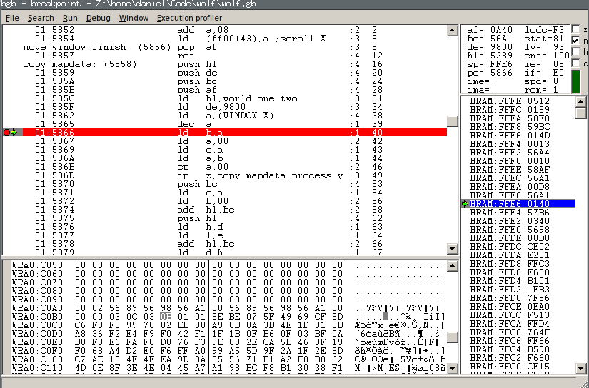

# The BGB Emulator/Debugger

The [BGB emulator](http://bgb.bircd.org/) is a Windows Gameboy emulator with
an awesome set of debugging/development tools. It runs nicely under
[Wine](https://www.winehq.org/).

BGB is very powerful but also not super well documented. Here's a rough guide to
using BGB for development and some tips/shortcuts.

## The debugger UI

There are four main areas in the debugger window:

1. The top left quadrant, showing instructions/code and highlighting the current
   address/line being executed (the PC register value). This is the largest
   quadrant of the debugger screen and the one you'll be using the most. In the
   screenshot above BGB is stopped at address `$5866` and the instruction
   `ld b,a`.
1. The bottom left quadrant, showing a region of memory in common hexdump
   format. In the screenshot above BGB is showing `$C050` to `$C11F`. It's hard
   to tell from the screenshot but the cursor has selected the address `$COB5`
   which holds the value `$0B`.
1. The top right quadrant, showing registers and flags. You'll frequently be
   scanning this area to understand the state of the CPU and its register set.
   As a quick example, in the screenshot above BGB shows the `AF` register pair
   having value `$0A40`, and the `z` flag is empty. The `PC` register value is
   `$5866`, which matches the address highlighted in the top left quadrant.
1. The bottom right quadrant, showing the stack. In the screenshot above the
   stack window is showing `$FFFE` to `$FFC0`. The top of the stack at `$FFE6`
   (indicated by the `SP` register) is highlighted to show where the next
   `pop`/`push` will occur.
