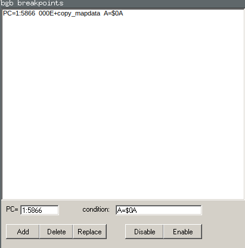
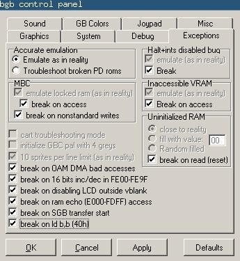

# The BGB Emulator/Debugger

The [BGB emulator](http://bgb.bircd.org/) is a Windows Gameboy emulator with
an awesome set of debugging/development tools. It runs nicely under
[Wine](https://www.winehq.org/).

BGB is very powerful but also not super well documented. Here's a rough guide to
using BGB for development and some tips/shortcuts.

## Debugger UI

There are four main areas in the debugger window:

1. **The disassembly view**: The _top left_ quadrant, showing instructions/code
   and highlighting the current address/line being executed (the PC register
   value). This is the largest quadrant of the debugger screen and the one 
   you'll be using the most. In the screenshot above BGB is stopped at address
   `$5866` and the instruction `ld b,a`.
1. **The hexdump view**: The _bottom left_ quadrant, showing a region of
   memory in common hexdump format. In the screenshot above BGB is showing
   `$C050` to `$C11F`. It's hard to tell from the screenshot but the cursor has
   selected the address `$COB5` which holds the value `$0B`.
1. **The register view**: The _top right_ quadrant, showing registers and
   flags. You'll frequently be scanning this area to understand the state of
   the CPU and its register set. As a quick example, in the screenshot above
   BGB shows the `AF` register pair having value `$0A40`, and the `z` flag is
   empty. The `PC` register value is `$5866`, which matches the address
   highlighted in the top left quadrant.
1. **The stack view**: The _bottom right_ quadrant, showing the stack. In the
   screenshot above the stack window is showing `$FFFE` to `$FFC0`. The top of
   the stack at `$FFE6` (indicated by the `SP` register) is highlighted to show
   where the next `pop`/`push` will occur.

## Debugger Controls

If you have experience with existing debuggers you might find BGB's terminology
a little bit non-standard/confusing. Most of these options (and a few more) are
under the _"Run"_ menu of the debugger (_Alt+R_). Selecting them from the menu
every time you're stepping through some assembly gets old fast so here's a quick
reference table with keyboard shortcuts and some terminology mappings that might
help folks experienced with other debuggers:

| **BGB Command**  | **Keyboard Shortcut** | **Comment**                               |
|------------------|-------------------|-----------------------------------------------|
| Run              | F9                | "Continue" in some debuggers                  |
| Run no break     | Shift-F9          | Run + ignore all breakpoints                  |
| Trace            | F7                | "Step Into" in some debuggers                 |
| Run to next line | F3                | "Step" in some debuggers                      |
| Run to cursor    | F4                | Run until line selected in disassembly view   |
| Step out         | F8                | Run until return from traced procedure call   |

### Go-To

One of the best controls for both the _hexdump view_ and the _disassembly view_
is the "_Go to_" control. You can access this in either view by pressing
**Ctrl-G** or right clicking and choosing "_Go to_".

You can enter:
1. A raw hex address, e.g. `$C000`
1. A label, e.g. `.copy_mapdata`
1. An offset, e.g. `000E+.copy_mapdata`

It's worth emphasizing that this works in the _hexdump view_. This is very handy for watching a variable change. For example:
1. Click the hexdump view
1. Hit *CTRL-G*
1. Enter `WINDOW_X` (a `DS` directive variable label from code)
1. Watch the hexdump view jump to the address of `WINDOW_X`, showing its current value
1. Click back to the disassembly view, step through execution. The hexdump view
remains centered on `WINDOW_X` and you can easily see its value change.

## Breakpoints

BGB has three kinds of breakpoints:

1. **Standard breakpoints**: Most often set by double clicking a line in the
   assembly view. These will stop execution unconditionally unless using "_Run no
   break_" or similar.
1. **Conditional breakpoints**: These breakpoints have a _condition_ attached
   and only halt execution when the condition is met. It's easiest to set this kind
   of breakpoint in breakpoints window.
1. **Access breakpoints**: These breakpoints are associated with a memory address
   and conditionally halt execution when that address is _read_, or _written to_, 
   or both. These breakpoints can be set quickly in the hexdump view by right
   clicking an address and choosing _"Set access breakpoint"_

The BGB Breakpoints window (shown above) can be accessed under the _Window_
menu of the titlebar. It shows **all** of the breakpoints that are set and lets
you enable/disable/and delete them. This is very handy if you forget where you
set some breakpoints!

In the screenshot above we can see there is one breakpoint. There are *three*
pieces of information shown about the breakpoint. In the _first column_ of
information we can see the breakpoint is set at **`PC=1:5866`**, e.g. this
breakpoint applies when `PC` is equal to `$5866`. In the _second column_ of the
breakpoint data the debugger kindly gives us a human readable label offset for
address `$5866`. In this case address `$5866` is `$000E` bytes (14 in base 10)
away from the `copy_mapdata` label. In the _third_ column we see this is a
conditional breakpoint with the condition expression `A=$0A`. So in sum, we
have a breakpoint at `$5866` that halts execution if the `A` register has the
value `$0A` when `PC==5866`.

## Strict Debugging

BGB can be configured to automatically break on many conditions that can happen
when your code is buggy. Enabling these breakpoints **at the very start of your
development!!** can save you a lot of time and frustration by catching hard to
reproduce bugs as soon as possible.

You can enable all of the debugger exceptions by selecting _Window_, then
_Options_, then clicking the _Exceptions_ tab. If you've enabled all of the
optional exceptions your _Exceptions_ tab should look like the following
screenshot:

A few highlights:

* Breaking on accesses to inaccessible VRAM will cause the debugger to halt if
  any of your code touches VRAM outside of a VBLANK when the LCD is on. This is very
  easy to do accidentally and normally results in ignored writes and weird graphics
  glitches.
* Breaking on uninitialized RAM will catch lots of simple memory errors like popping
  the wrong return address off of the stack and jumping into a pile of nothing.
* Breaking on disabling the LCD outside of VBLANK is great for making sure your
  game init routines handle the LCD control register correctly.
